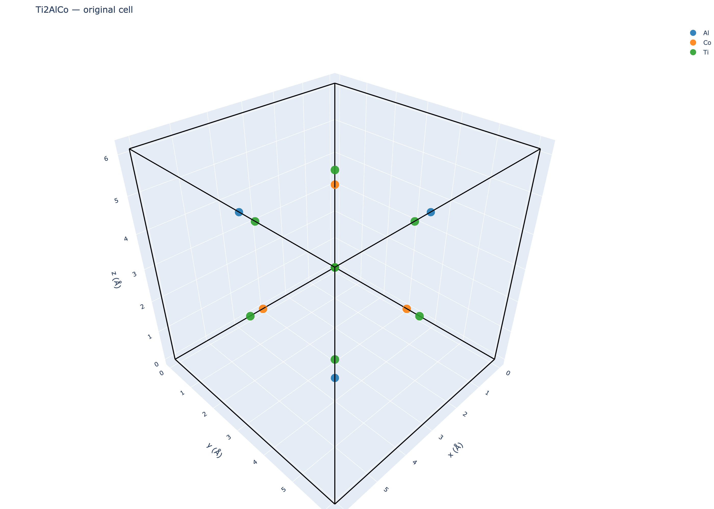
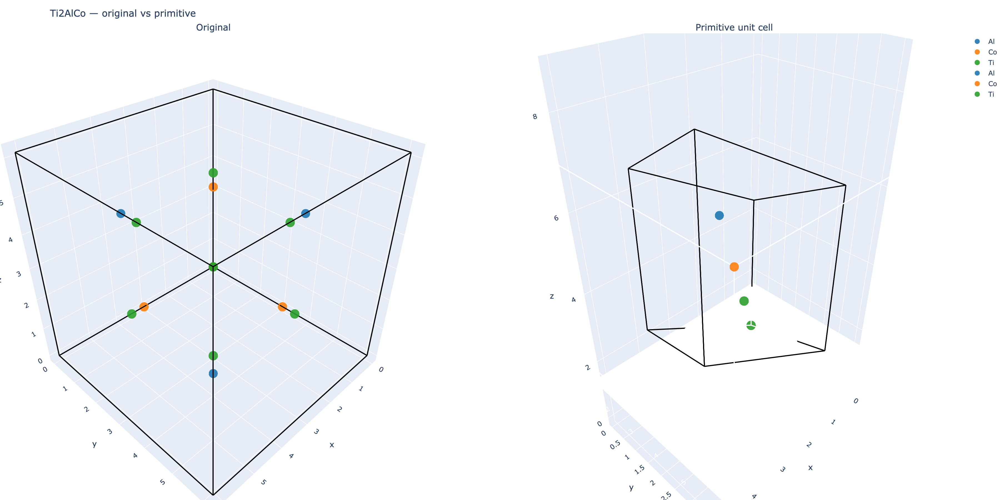

## Lattices: CIF primitive-cell reducer and visualizer

This project parses CIF files from `Systems/`, reduces each to its primitive unit cell, and generates both CIF outputs and interactive/static visualizations for quick inspection.

### What it does
- Reads all `.cif` files in `Systems/`
- Uses crystallographic symmetry to find the primitive unit cell
- Writes the reduced cells to `Systems_unitcells/`
- Builds interactive 3D HTML views for originals, primitives, and side-by-side comparisons into `Visualizations/`
- Exports high-res PNGs and supports a Crystal Toolkit app for rich viewing

### Largest original cell: Ti2AlCo

Crystal Toolkit comparison (Original vs Primitive):


If you prefer the Plotly static renders used earlier:

- Original (F-43m, 16 sites, ~230.99 ų):



- Original vs Primitive (primitive has 4 sites, ~57.75 ų):



### Quick start
```bash
# Create and activate a local environment (macOS/Linux)
python3 -m venv .venv
source .venv/bin/activate

# Install dependencies
python -m pip install -U pip setuptools wheel
python -m pip install -r requirements.txt

# Generate primitive CIFs
python make_unit_cells.py

# Create interactive HTML visualizations
python visualize_lattices.py

# Export PNGs (used in this README)
python export_images.py
```

### Crystal Toolkit app
Run a side-by-side viewer for originals and primitives:
```bash
/opt/homebrew/bin/python3.11 -m venv .venv311
source .venv311/bin/activate
python -m pip install crystal-toolkit
python ct_app.py
# then open http://127.0.0.1:8050
```

### File overview
- `Systems/`: input CIFs
- `Systems_unitcells/`: output primitive CIFs
- `Visualizations/`: interactive Plotly HTMLs
- `assets/`: exported PNGs
- `make_unit_cells.py`: reduces to primitive unit cells
- `visualize_lattices.py`: builds 3D HTMLs
- `export_images.py`: exports PNGs for documentation
- `ct_app.py`: Crystal Toolkit Dash app for interactive viewing

### Notes
- Some inputs may already be primitive; in that case, output equals input.
- Precision tolerances can affect detection; current scripts use a reasonable default.


